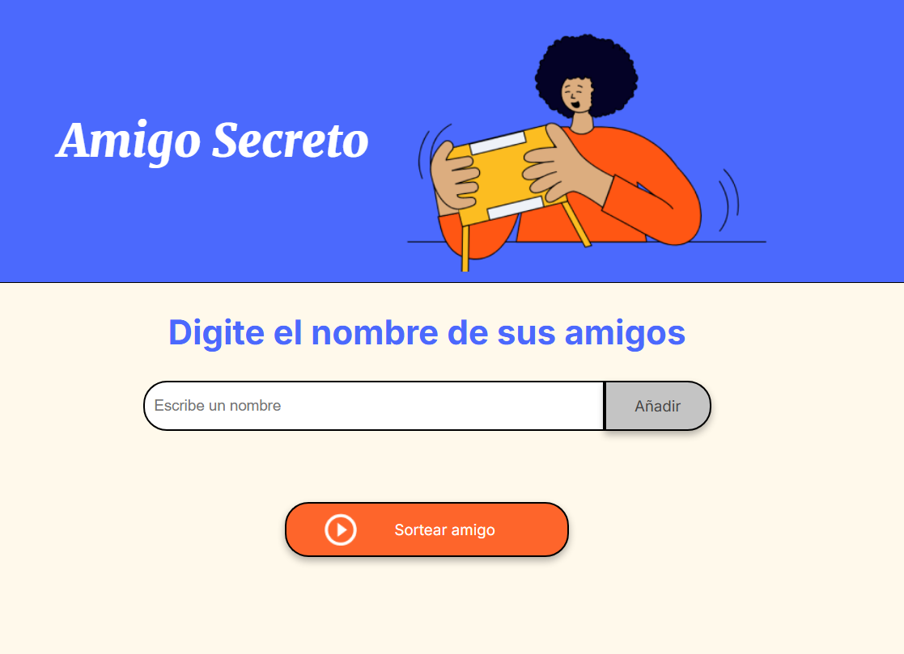

    <h1 align="center"> Amigo Secreto
     
     
    
    </h1>

 Se trata de una app sencilla en JavaScript que permite a los usuarios ingresar nombres de amigos en una lista para luego realizar un sorteo aleatorio y determinar quién es el amigo secreto 

## Cómo agregar amigos y sortear

 Para utilizar la aplicación haga click en la imagen o en el siguiente enlace: 

<h1 align="center">

[AMIGO SECRETO](https://ezef86.github.io/amigo-secreto/)

</h1>

 Ingrese la cantidad de amigos que desee uno por uno en el formulario pulsando la tecla 'enter' por cada amigo, o bien haciendo click en el botón 'Añadir'

 La cantidad mínima para sortear es de 2 amigos. Una vez que agregó todos los amigos, pulsando el botón 'Sortear amigo', la aplicación elegirá un amigo al azar
